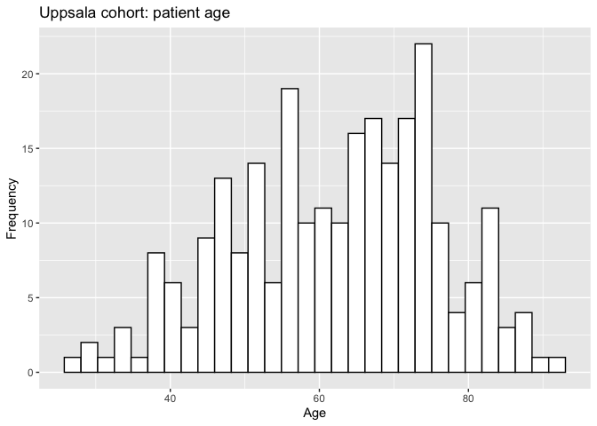
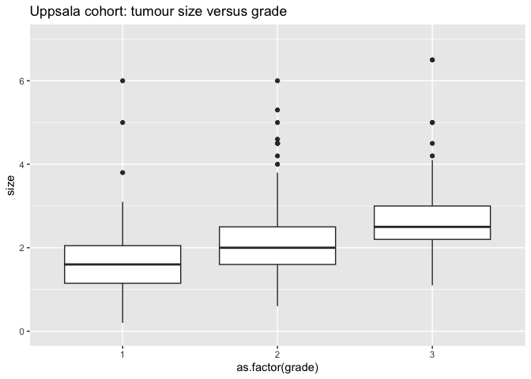
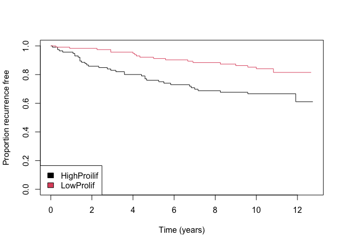

PATH302 - Breast Cancer Data
================
Professor Mik Black
25 August 2023

<!-- first run this code to generate GitHub formatted markdown: -->
<!-- rmarkdown::render('PATH302-brcaData.Rmd', output_format="github_document") -->
<!-- then knit the document to generate html -->
<!-- then on the command line run:  -->
<!-- wkhtmltopdf --footer-spacing 7 --footer-font-size 10 --footer-left 'PATH302' --footer-right '[page]/[topage]' --minimum-font-size 15 -B 23 -T 20 -R 20 -L 20 PATH302-brcaData.html PATH302-brcaData.pdf -->
<!-- This gets around the issue of getting "double links" when printing to PDF from a browser. -->

In this lab we will be using the R computing environment to perform a
basic analysis of gene expression data from a breast cancer data set.

The data we will be using comes from the following publication:

Miller, L. D., Smeds, J., George, J., Vega, V. B., Vergara, L., Ploner,
A., et al. (2005). An expression signature for p53 status in human
breast cancer predicts mutation status, transcriptional effects, and
patient survival. *Proceedings of the National Academy of Sciences of
the United States of America*, 102(38), 13550–13555.

It comprises microarray and clinical data generated from tumour samples
obtained from 251 female breast cancer patients from Uppsala County,
Sweden, from January 1, 1987 to December 31, 1989. While this is a
relatively old data set, it still reflects the type of data generated in
clinical genomics studies today (i.e., sequencing-based transcriptomic
data from tumours).

An online version of this document can be accessed at:

<https://github.com/mikblack/PATH302/blob/master/PATH302-brcaData.md>

## Computer setup

Two options:

- Running R and RStudio on the Student Desktop:
  <https://student.desktop.otago.ac.nz>
- Running R and RStudio your own computer

Use the instructions below that match your computing setup.

### Running on the Student Desktop

Click on the Windows Start Menu in the bottom left of the Student
Desktop, and open the RStudio application.

#### Package installation

In order to access the data and commands needed for this lab, we first
need to install some add-on packages. Run the commands below in R to do
this (you can just cut and paste these commands into the R console - if
you’re not sure what this means, just let me know):

``` r
dir.create('Rlibs')
newPath = c(.libPaths(), paste0(getwd(), "/Rlibs"))
.libPaths(newPath)

install.packages(c('magrittr','gplots','httr','BiocManager'), lib='Rlibs')
BiocManager::install(lib='Rlibs')
```

- Type ‘n’ (and hit ‘enter’) if presented with:
  `Update all/some/none? [a/s/n/]:`
- You can ignore any warnings about packages being built under a
  different version of R.

### Running on your own computer

If you already have working versions of R and RStudio installed on your
computer, you can skip ahead to “package installation” below.

#### Installing R and RStudio

You need to install both R *and* RStudio on your computer.

- Download R from: <http://cran.auckland.ac.nz/>
- Download RStudio from:
  <https://posit.co/download/rstudio-desktop/#download>

Once you have installed both applications, open RStudio (don’t open the
R application - we’ll use R through the RStudio interface).

#### Package installation

In order to access the data and commands needed for this lab, we first
need to install some add-on packages. Run the commands below in R to do
this (you can just cut and paste these commands into the R console - if
you’re not sure what this means, just let me know):

``` r
install.packages(c('ggplot2', 'tibble', 'magrittr', 'gplots', 'httr', 'BiocManager'))
library(BiocManager)
install('Biobase')
```

- Type ‘n’ (and hit ‘enter’) if presented with:
  `Update all/some/none? [a/s/n/]:`
- You can ignore any warnings about packages being built under a
  different version of R.

## Loading packages and data

Do the following, regardless of whether you are running RStudio on your
computer, or on the student desktop (same instructions for both).

### Load packages

The following commands load packages that we will use in our analysis
(you can ignore any warnings about packages being built under a
different version of R).

``` r
library(Biobase)
library(ggplot2)
library(magrittr)
library(gplots)
library(survival)
library(httr)
```

### Load data

Unfortunately, due to the way in which the student desktop is set up,
the package that contains that data, `breastCancerUPP` can’t easily be
installed. For consistency, use the following workaround, even if you
are using RStudio on your own computer.

I have instead created a data file containing the required information,
that can be loaded via the following command:

``` r
load(url("https://github.com/mikblack/PATH302/raw/master/uppsalaCohort.RData"))
```

This loads a data object called `upp` which holds LOTS of relevant
information about the Uppsala breast cancer cohort. We are interested in
data about: gene expression, microarray probe annotation (so we can
understand what gene each microarray probe relates to) and clinical
information about the patients. It also loads an object called
`PAM50Preds` which we’ll use later.

## Analysis of breast cancer gene expression data

Now we can start the fun stuff!

### Extract cohort data

Gene expression data:

``` r
uppExp = exprs(upp)
```

View data using RStudio built-in viewer

``` r
View(uppExp)
```

Gene annotation data

``` r
uppAnnot = featureData(upp)@data
```

``` r
View(uppAnnot)
```

Clinical data:

``` r
uppClin  = phenoData(upp)@data
```

``` r
View(uppClin)
```

### Clinical data

From looking at the clinical data (using the `View()` command), it is
clear that some of the variables contain no useful information. Let’s
select a subset of variables:

``` r
uppClinSmall = uppClin[,c("size", "age", "er", "grade", "pgr", 
                          "node", "t.rfs", "e.rfs","treatment")]
```

Now we have a smaller data object to work will. Take a look:

``` r
View(uppClinSmall)
```

Note that the “recurrence free survival time”, `rfs.t` variable is given
in “days”, but “years” is easier to interpret. Convert RFS time to years
(from ‘days’):

``` r
uppClinSmall$t.rfs = uppClinSmall$t.rfs / 365
```

Attach data so that we can directly access the clinical variables by
name

``` r
attach(uppClinSmall)
```

    ## The following objects are masked from uppClinSmall (pos = 3):
    ## 
    ##     age, e.rfs, er, grade, node, pgr, size, t.rfs, treatment

    ## The following objects are masked from uppClinSmall (pos = 4):
    ## 
    ##     age, e.rfs, er, grade, node, pgr, size, t.rfs, treatment

    ## The following objects are masked from uppClinSmall (pos = 5):
    ## 
    ##     age, e.rfs, er, grade, node, pgr, size, t.rfs, treatment

    ## The following objects are masked from uppClinSmall (pos = 6):
    ## 
    ##     age, e.rfs, er, grade, node, pgr, size, t.rfs, treatment

    ## The following objects are masked from uppClinSmall (pos = 7):
    ## 
    ##     age, e.rfs, er, grade, node, pgr, size, t.rfs, treatment

    ## The following objects are masked from uppClinSmall (pos = 8):
    ## 
    ##     age, e.rfs, er, grade, node, pgr, size, t.rfs, treatment

    ## The following objects are masked from uppClinSmall (pos = 9):
    ## 
    ##     age, e.rfs, er, grade, node, pgr, size, t.rfs, treatment

    ## The following objects are masked from uppClinSmall (pos = 10):
    ## 
    ##     age, e.rfs, er, grade, node, pgr, size, t.rfs, treatment

    ## The following objects are masked from uppClinSmall (pos = 11):
    ## 
    ##     age, e.rfs, er, grade, node, pgr, size, t.rfs, treatment

    ## The following objects are masked from uppClinSmall (pos = 12):
    ## 
    ##     age, e.rfs, er, grade, node, pgr, size, t.rfs, treatment

    ## The following objects are masked from uppClinSmall (pos = 13):
    ## 
    ##     age, e.rfs, er, grade, node, pgr, size, t.rfs, treatment

    ## The following objects are masked from uppClinSmall (pos = 14):
    ## 
    ##     age, e.rfs, er, grade, node, pgr, size, t.rfs, treatment

    ## The following objects are masked from uppClinSmall (pos = 15):
    ## 
    ##     age, e.rfs, er, grade, node, pgr, size, t.rfs, treatment

    ## The following objects are masked from uppClinSmall (pos = 16):
    ## 
    ##     age, e.rfs, er, grade, node, pgr, size, t.rfs, treatment

    ## The following objects are masked from uppClinSmall (pos = 17):
    ## 
    ##     age, e.rfs, er, grade, node, pgr, size, t.rfs, treatment

    ## The following objects are masked from uppClinSmall (pos = 18):
    ## 
    ##     age, e.rfs, er, grade, node, pgr, size, t.rfs, treatment

    ## The following objects are masked from uppClinSmall (pos = 19):
    ## 
    ##     age, e.rfs, er, grade, node, pgr, size, t.rfs, treatment

    ## The following objects are masked from uppClinSmall (pos = 20):
    ## 
    ##     age, e.rfs, er, grade, node, pgr, size, t.rfs, treatment

    ## The following objects are masked from uppClinSmall (pos = 21):
    ## 
    ##     age, e.rfs, er, grade, node, pgr, size, t.rfs, treatment

    ## The following objects are masked from uppClinSmall (pos = 22):
    ## 
    ##     age, e.rfs, er, grade, node, pgr, size, t.rfs, treatment

    ## The following objects are masked from uppClinSmall (pos = 23):
    ## 
    ##     age, e.rfs, er, grade, node, pgr, size, t.rfs, treatment

    ## The following objects are masked from uppClinSmall (pos = 24):
    ## 
    ##     age, e.rfs, er, grade, node, pgr, size, t.rfs, treatment

For example:

``` r
grade
```

    ##   [1]  3  3  2  1  2  3  1  1  3  3 NA  2  2  2  2  2  3  2  2  2  2  2  1  2  2  2  2  2  2  3  2  2  1  2  2  2  2  1  3  2  2  2  3  2  2  3
    ##  [47]  2  2  1  3  2  2  2  3  3  2  1  2  2  3  1  2  2  3  2  2  2  3  3  1  1  3  2  3  2  3  2  2  1  2  1  3  3  1  1  1  2  3  3  2  2  2
    ##  [93]  2  3  1  2  2  2  2  2  3  3  2  2  3  2  2  3  1  1  2  1  2  1  2  2  2  3  1  2  2  1  2  2  1  1  3  1  1  2  2  2  1  1  1  2  2  2
    ## [139]  1  3  2  1  1  2  2  1  2  2  2  2  2  1  1  2  3  2  1  3  1  1  2  1  3  1  3  1  2  2  2  3  2  1  1  2  1  3  2  3  2  1  2  2  2  1
    ## [185]  2  1  1  1  2  1  1  2  3  3  3  2  2  2  2  2  3  2  1  2  1  2  3  1  2  2  1  2  2  3  3  2  1  3 NA  1  1  2  2  3  1  2  2  1  2  1
    ## [231]  2  1  3  2  2  2  1  3  1  3  3  3  1  2  2  2  2  3  2  1  2

The clinical variables are:

| Variable  | Description                                               |
|:----------|:----------------------------------------------------------|
| size      | Tumour Size (cm)                                          |
| age       | Patient age at diagnosis (years)                          |
| er        | Estrogen receptor status (0=negative, 1=positive)         |
| grade     | Tumour Grade (1, 2, or 3)                                 |
| pgr       | Progesterone receptor status (0=negative, 1=positive)     |
| node      | Lymph node status (0=negative, 1=positive)                |
| t.rfs     | Recurrence free survival time (years)                     |
| e.rfs     | Recurrence free survival event (0=censored, 1=recurrence) |
| treatment | Treatment (0=none, 2=endocrine treatment or chemotherapy  |

#### Plots of clinical data

Let’s make some plots: we are using the `ggplot2` framework for
plotting. The first part of each plot specification (the `ggplot` part)
provides information at the data object to be used (`uppClinSmall`) and
the variable(s) of interest (`size`). The next piece (the `geom_` part)
tells R what sort of plot we want to make - in this case it is a
histogram (`geom_histogram()`). The details inside the `geom_histogram`
function specify the bar colours (outline and fill), and the `xlab`,
`ylab` and `ggtitle` commands specify the axis labels and plot title:

``` r
ggplot(data=uppClinSmall, aes(x=size)) + 
  geom_histogram(fill="white", colour="black") +
  xlab("Tumour Size") +
  ylab("Frequency") + 
  ggtitle("Uppsala cohort: tumour size")
```

<!-- -->

**Challenge 1:** *modify the code above to produce the following graph:*

<!-- -->

There are **LOTS** of plots we can make. Here’s a boxplot showing the
distribution of tumour size across tumour grade:

``` r
ggplot(data=uppClinSmall, aes(x=as.factor(grade),y=size)) + 
  geom_boxplot()
```

<!-- -->

Get rid of the annoying large `size` value using the `ylim` command to
change the limits on the y-axis, and the `NA` values in `grade` using
the `subset` command:

``` r
ggplot(data=subset(uppClinSmall, !is.na(grade)), aes(x=as.factor(grade),y=size)) + 
  geom_boxplot() +
  ylim(0,7) +
  ggtitle("Uppsala cohort: tumour size versus grade")
```

<!-- -->

**Challenge 2:** *Modify the code above to generate the following plot:*

<!-- -->

What do you conclude about the relationship between ER status and tumour
size?

#### Tables of clinical data

We can also use R to generate tables relating to the clinical variables.
For example, ER status:

``` r
table(er)
```

    ## er
    ##   0   1 
    ##  34 213

We can also calculate proportions using the `prop.table` command:

``` r
table(grade)
```

    ## grade
    ##   1   2   3 
    ##  67 128  54

``` r
prop.table( table(grade) )
```

    ## grade
    ##         1         2         3 
    ## 0.2690763 0.5140562 0.2168675

Adding a second variable to the `table` command creates a two-way
contingency table:

``` r
table(er, grade)
```

    ##    grade
    ## er    1   2   3
    ##   0   2  11  21
    ##   1  62 116  33

The `prop.table` command then provides multiple options:

``` r
## Overall proportions:
prop.table(table(er, grade))
```

    ##    grade
    ## er            1           2           3
    ##   0 0.008163265 0.044897959 0.085714286
    ##   1 0.253061224 0.473469388 0.134693878

``` r
## Proportions by row (rows sum to 1)
prop.table(table(er, grade),1)
```

    ##    grade
    ## er           1          2          3
    ##   0 0.05882353 0.32352941 0.61764706
    ##   1 0.29383886 0.54976303 0.15639810

``` r
## Proportions by columns (columns sum to 1)
prop.table(table(er, grade),2)
```

    ##    grade
    ## er           1          2          3
    ##   0 0.03125000 0.08661417 0.38888889
    ##   1 0.96875000 0.91338583 0.61111111

If we want to test whether two variables are significantly associated,
Fisher’s Exact Test can be applied to the contingency table:

``` r
fisher.test(table(er, grade))
```

    ## 
    ##  Fisher's Exact Test for Count Data
    ## 
    ## data:  table(er, grade)
    ## p-value = 7.54e-08
    ## alternative hypothesis: two.sided

Alternatively the Chi-squared test (which is an approximation) can be
used:

``` r
chisq.test(table(er, grade))
```

    ## 
    ##  Pearson's Chi-squared test
    ## 
    ## data:  table(er, grade)
    ## X-squared = 37.347, df = 2, p-value = 7.767e-09

**Challenge 3:** *Generate a table of ER status versus Lymph Node
Status, and determine whether they are significantly associated with
each other.*

### Molecular subtyping

We can use the microarray data to generate a *molecular subtype* for
each tumour. To do this we use the `molecular.subtyping` command from
the `genefu` package. There are a number of subtyping methods
available - we are using the popular “PAM50” approach, which uses the
expression patterns of collection of 50 genes to put each tumour into
one of five subtypes: Basal-like, Her2/Neu, Luminal A, Luminal B and
Normal-like. The command parameters specify the subtyping model to be
used (`pam50`), the gene expression data (`uppExp` - note that the
matrix needs to be transposed (rotated 90 degrees), hence the `t()`
function), and annotation information linking probes to genes
(`uppAnnot`). You can use the R help facility (via
`?molecular.subtyping`) to find out what the `do.mapping` parameter
does, if you are interested. :)

**YOU DON’T NEED TO RUN THE NEXT BLOCK OF CODE.**

**the `genefu` package that performs the molecular subtyping is annoying
to install, because it has a large number of package dependencies. As a
result, I have peformed this for you, using the code below, and the
object `PAM50Preds` was loaded with the Uppsala cohort data above.**

``` r
## DON'T RUN THIS CODE:
library(genefu)
PAM50Preds = molecular.subtyping(sbt.model = "pam50", data=t(uppExp),
                                annot=uppAnnot, do.mapping=TRUE)
```

This produces the following subtype information:

``` r
## DO RUN THIS CODE:
table(PAM50Preds$subtype)
```

    ## 
    ##  Basal   Her2   LumB   LumA Normal 
    ##     26     32     76    104     13

We can add this information to the clinical data:

``` r
uppClinSmall$subtype = PAM50Preds$subtype
attach(uppClinSmall)
```

Compare Subtype to ER status:

``` r
table(subtype, er)
```

    ##         er
    ## subtype   0  1
    ##   Basal  15 11
    ##   Her2   15 17
    ##   LumB    1 73
    ##   LumA    3 99
    ##   Normal  0 13

``` r
table(subtype, er) %>% 
  prop.table(., 1) %>% 
  round(., 3)
```

    ##         er
    ## subtype      0     1
    ##   Basal  0.577 0.423
    ##   Her2   0.469 0.531
    ##   LumB   0.014 0.986
    ##   LumA   0.029 0.971
    ##   Normal 0.000 1.000

Note - the use of the “pipe” operator, `%>%` illustrates a fancy (and
more readable) way of writing

``` r
round( prop.table( table(subtype, er), 1) ,3)
```

    ##         er
    ## subtype      0     1
    ##   Basal  0.577 0.423
    ##   Her2   0.469 0.531
    ##   LumB   0.014 0.986
    ##   LumA   0.029 0.971
    ##   Normal 0.000 1.000

Which approach do you prefer?

**Challenge 4:** *Modify the code above to investigate the relationship
between Grade and Subtype. Which subtype has the highest proportion of
Grade 3 tumours? Is the association between Grade and Subtype
statistically significant?*

### Survival analysis

We can use the `survival` package (installed as part of base R, and
loaded above) to examine the survival characteristics of patients in the
Uppsala breast cancer cohort. Here we have “Recurrence Free Survival”
data available, so a “survival event” relates to cancer relapse: either
local of distant metastasis. The “survival time” indicates either the
number of years after initial treatment (surgery) that cancer recurrence
was detected, or (if there has been no recurrence), the number of years
after surgery that the patient was last observed. Patients who were
disease-free when they were last seen are considered “censored”, because
we don’t know their current status.

``` r
plot( survfit(Surv(t.rfs, e.rfs) ~1 ), 
      xlab="Time (years)", 
      ylab = "Proportion recurrence free")
```

<!-- -->

``` r
plot( survfit(Surv(t.rfs, e.rfs) ~ er ), col=1:2, 
      xlab="Time (years)", 
      ylab = "Proportion recurrence free")
legend('bottomleft', c("ER-", "ER+"), fill=1:2)
```

<!-- -->

**Challenge 5:** *Modify the code above to generate a survival plot for
tumour grade. Does relationship between grade and recurrence free
survival match what you would expect?*

The following is a survival plot for tumour subtype.

`{r]} plot( survfit(Surv(t.rfs, e.rfs) ~ subtype ), col=1:5,        xlab="Time (years)",        ylab = "Proportion recurrence free") groups <- names(table(subtype)) legend('bottomleft', groups, fill=1:5)`

We can test to see whether the relationship between subtype and survival
is significant using the `survdiff` command:

``` r
survdiff(Surv(t.rfs, e.rfs) ~ subtype)
```

    ## Call:
    ## survdiff(formula = Surv(t.rfs, e.rfs) ~ subtype)
    ## 
    ## n=234, 17 observations deleted due to missingness.
    ## 
    ##                 N Observed Expected (O-E)^2/E (O-E)^2/V
    ## subtype=Basal  23        5     5.77    0.1025   0.11523
    ## subtype=Her2   29        9     5.25    2.6869   2.98982
    ## subtype=LumB   75       25    16.04    5.0116   7.16507
    ## subtype=LumA   94       12    24.11    6.0844  11.06145
    ## subtype=Normal 13        3     2.84    0.0093   0.00985
    ## 
    ##  Chisq= 14  on 4 degrees of freedom, p= 0.007

We can see that the result is highly significant, so we conclude that
the different tumour subtypes are associated with differences in
recurrence free survival rates.

**Challenge 6:** *Modify the code above to test for an association
between grade and survival. What do you conclude?*

### Gene expression data

Up to this point, we have only been looking at clinical data for the
Uppsala cohort (although we did use the gene expression information to
determine the tumour subtypes).

Here we are going to have a look at a subset of the gene expression data
for each tumour, and examine some associations with clinical
information. We’ll start by looking at gene expression for ESR1, a gene
that encodes an estrogen receptor.

Let’s find the microarray probe(s) for ESR1:

``` r
esr1Probes = uppAnnot$probe[ na.omit(uppAnnot$Gene.symbol == 'ESR1') ]
esr1Probes
```

    ##  [1] "205221_at"   "211122_s_at" "211123_at"   "211124_s_at" "211508_s_at" "215228_at"   "215229_at"   "216460_at"   "216482_x_at"
    ## [10] "240973_s_at"

There are multiple probes, but the best one to use is the first one:
`esr1Probes[1]` (trust me).

We need to then figure out what row of the gene expression data this
relates to:

``` r
match("205221_at", rownames(uppExp))
```

    ## [1] 4748

Create an object with this value

``` r
esr1probe = match("205221_at", rownames(uppExp))
```

and then use it to extract the data from that row:

``` r
esr1Dat = uppExp[esr1probe, ]
```

To make things easy, lets add this variable to our clinical data:

``` r
uppClinSmall$esr1Dat = esr1Dat
attach(uppClinSmall)
```

Now we can make a boxplot to examine ESR1 expression across ER- (0) and
ER+ (1) tumours:

``` r
ggplot(data=subset(uppClinSmall, !is.na(er)), aes(x=as.factor(er), y=esr1Dat)) + geom_boxplot()
```

<!-- -->

**Challenge 7:** *Explain what the boxplot above shows. Is this what you
would expect?*

### Proliferation genes

The genes below are involved in cellular proliferation, and
proliferation plays an important role in the growth and development of
tumours.

| Gene   | Probe       |
|:-------|:------------|
| MAD2L1 | 203362_s_at |
| RRM2   | 201890_at   |
| ANLN   | 222608_s_at |
| MCM6   | 201930_at   |
| PBK    | 219148_at   |
| GINS2  | 221521_s_at |
| KPNA2  | 201088_at   |
| PCNA   | 201202_at   |

Create an object containing the names of the proliferation genes:

``` r
prolifGenes = c("MAD2L1", "RRM2", "ANLN", "MCM6", "PBK", "GINS2", "KPNA2", "PCNA")
```

We can use the `match` command to find which rows of the gene expression
data set correspond to these proliferation genes. Note that using
`match` only finds the first match to the gene name - if there are
multiple probes for a gene, then we will only retrieve the first one.
This is not the best way to operate, but it will suffice for what we are
doing here (in practice, we often merge probe data together when there a
multiple probes representing a single gene).

``` r
prolifRows = na.omit(match(prolifGenes, uppAnnot$Gene.symbol))
```

Here are the rows of the gene expression data set that relate to our
proliferation genes:

``` r
prolifRows
```

    ## [1]  2889  1418 22607  1458 18512 20884   616   730

Extract the data for these rows:

``` r
prolifDat = uppExp[prolifRows, ]
```

The following code is a little ugly, but it does two important things:

1.  it transforms each gene to have a mean of zero and a standard
    deviation of 1 (i.e., it puts all of the genes on the same scale,
    which helps with data visualisation).

2.  it sets any transformed value above 3 (or less than -3) to 3 (-3) so
    that there are no extreme values (this makes sure that the range of
    our visualisation isn’t too great.)

``` r
prolifDatScale = t(scale(t(prolifDat)))
prolifDatScale[prolifDatScale < -3] = -3
prolifDatScale[prolifDatScale >  3] =  3
```

After transforming the data, we can visualise the gene expression
information for the proliferation genes using a *heatmap*. Although R
has a built-in heatmap command (`heatmap`), the `gplots` package has a
greatly improved function (imaginatively titled `heatmap.2`) that we
will use:

``` r
heatmap.2(prolifDatScale, trace='none', scale='none', col='bluered', 
          labRow = uppAnnot$Gene.symbol[prolifRows])
```

<!-- -->

**Challenge 8:** *Explain what is being shown in the heatmap.*

Since all of the proliferation genes are basically behaving in the same
way, we can summarise their activity by taking their mean for each
sample. This type of summary is called a “centroid”. We use the
`colMeans` function to take the mean of each column (i.e., per-patient
mean across the proliferation genes):

``` r
prolifMean = colMeans(prolifDat)
```

This generates a single value for each tumour, which can be thought of
as an indication of the level of proliferative activity. To see how this
summary relates to the original data, we can add the information above
the heatmap, and then order the columns of the heatmap according to the
centroid values (instead of using the default clustering provided by the
`heatmap.2` command):

First, get the order of the centroid values, and create colors relating
to those values:

``` r
ord = order(prolifMean)
prolifCol = bluered(length(prolifMean))[rank(prolifMean)]
```

Next, use the `heatmap.2` command again, but this time tell it not to do
the clustering for the columns (`Colv=FALSE`), and instead to use the
`ord` variable to determine the ordering of the columns and the colour
object (`prolifCol`):

``` r
heatmap.2(prolifDatScale[,ord], trace='none', scale='none', col='bluered', 
          labRow = uppAnnot$Gene.symbol[prolifRows], Colv=FALSE,
          ColSideColors=prolifCol[ord])
```

    ## Warning in heatmap.2(prolifDatScale[, ord], trace = "none", scale = "none", : Discrepancy: Colv is FALSE, while dendrogram is `both'. Omitting
    ## column dendogram.

<!-- -->

Now we can clearly see that low values of the centroid (blue) correspond
to uniformly low expression levels for the proliferation genes, and vice
versa (high centroid value (red), corresponds to high gene expression).
This suggests that our proliferation centroid can be used as an
effective summary of the activity of those proliferation genes. How can
we use this information?

Having a one-dimensional summary like a centroid (i.e., one value per
tumour) allows us to investigate the relationship between proliferation
and other variables we have available, for example, our clinical
variables. Lets add the proliferation centroid to our clinical data:

``` r
uppClinSmall$prolifMean = prolifMean
attach(uppClinSmall)
```

Here is a boxplot showing the distribution of the proliferation centroid
across tumour grade.

``` r
ggplot(data=subset(uppClinSmall, !is.na(grade)), aes(x=as.factor(grade), y=prolifMean)) + geom_boxplot()
```

<!-- -->

**Challenge 9:** *Modify the above code to investigate the relationship
between proliferation and tumour subtype. What does the plot tell you?*

Lastly, we can use the centroid to define groups of tumours with
particular characteristics. Here we will split the tumours into two
groups, one exhibiting “low” proliferation” (values below centroid
median), and one exhibiting “high” proliferation” (values above centroid
median).

``` r
prolifHilo = ifelse(prolifMean > median(prolifMean), "HighProilif", "LowProlif")
```

This puts half the tumours in the “low” group, and half in the “high”
group:

``` r
table(prolifHilo)
```

    ## prolifHilo
    ## HighProilif   LowProlif 
    ##         125         126

Now we can investigate the relationship with other variables, for
example, grade:

``` r
table(grade, prolifHilo)
```

    ##      prolifHilo
    ## grade HighProilif LowProlif
    ##     1          13        54
    ##     2          61        67
    ##     3          51         3

We can also investigate the relationship between proliferation and
patient survival:

``` r
plot( survfit(Surv(t.rfs, e.rfs) ~ prolifHilo ), col=1:2, 
      xlab="Time (years)", ylab = "Proportion recurrence free")
groups <- names(table(prolifHilo))
legend('bottomleft', groups, fill=1:2)
```

<!-- -->

**Challenge 10:** *What does the plot above tell you about the
relationship between proliferative activity in the tumour, and
recurrence free survival?*
